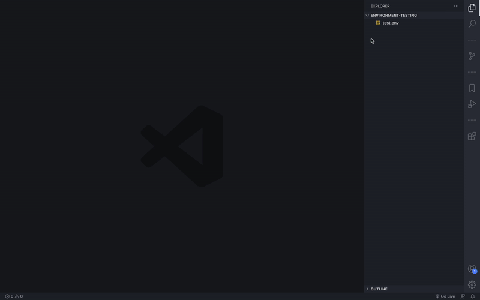
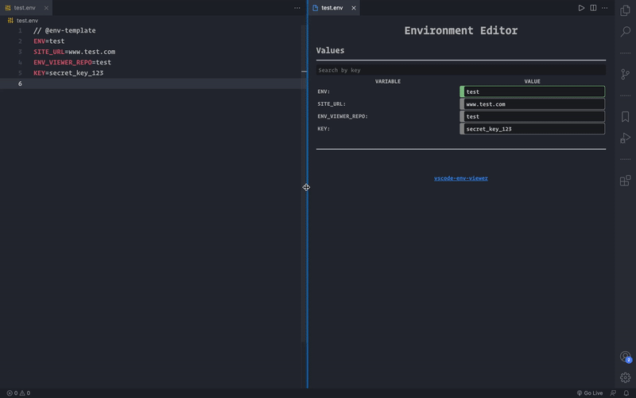
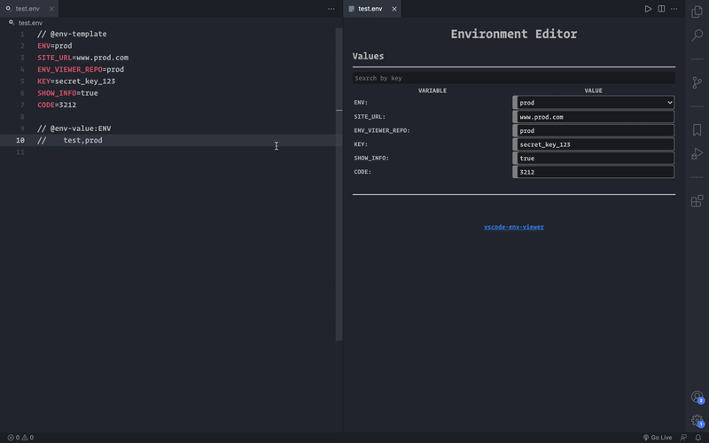
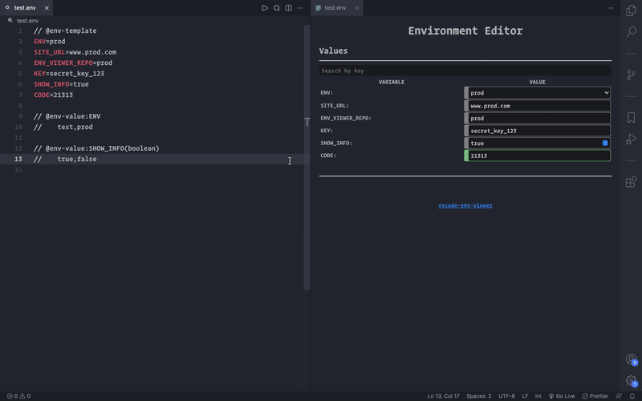
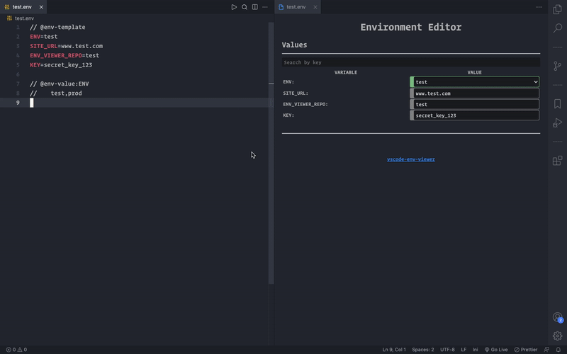

[![version]][items]
[![install]][items]
[![downloads]][items]

<!-- PROJECT LOGO -->
<br />
<p align="center">
<h3 align="center"><a href="https://github.com/olmedoluis/vscode-env-viewer">ENV Viewer</a></h3>
    <p align="center">
        Interactive view for environment variables files
        <br />
        <a href="https://marketplace.visualstudio.com/items?itemName=LuisOlmedo.env-viewer"><strong>Visual studio market place</strong></a>
        <br />
        <br />
        <a href="https://github.com/olmedoluis/vscode-env-viewer/issues">Report Bug</a>
        •
        <a href="https://github.com/olmedoluis/vscode-env-viewer/issues">Request Feature</a>
    </p>
</p>

&nbsp;

## About The Project

This extension allows you to change environment variables with a handy interface. You can easily search for variables, change their values by hand or leave default values to select.

I couldn't find a better way to organize environment variables. Even separating the variables with comments or also explaining with comments too, it never got better.

With this extension you will not have to rembember what values should be changed or what values that variable can take in order to get the desired result.

&nbsp;

## Usage

Go to your .env file and click on the magnifying glass icon at the top right menu.

> :information_source: **You must use at least env-template tag** to let the extension know where values will be overwritten.

&nbsp;

There is three tags that can be used while writting out .env file:

### **Env Template Tag**:

---

This tag is meant to mark the values that will take effect over our application.

<p align="center">
  
</p>

> :information_source: **They should be written without any comments or spaces between** since all those values can be overwritten by the user.

&nbsp;

#### **Code shown in the example:**

```ini
// @env-template
ENV=test
SITE_URL=www.test.com
ENV_VIEWER_REPO=test
KEY=secret_key_123
```

&nbsp;

### **Env Value Tag**:

---

This tag is meant to mark the values that a environment variable can take.

<p align="center">
  
</p>

> :information_source: **They should be written without any comments or spaces between**.

&nbsp;

#### **Code shown in the example:**

```ini
// @env-template
ENV=test
SITE_URL=www.test.com
ENV_VIEWER_REPO=test
KEY=secret_key_123

// @env-value:ENV
//    test,prod
```

&nbsp;

> :information_source: **Env Value tags also has types that can be specified.** If you do not specify "select" is the default type.

#### **Boolean**:

Boolean inputs allows you to choose between two different values. The first value you set will be the value who represents the "true" value.

<p align="center">
  
</p>

```ini
// @env-template
ENV=test
SITE_URL=www.test.com
ENV_VIEWER_REPO=test
KEY=secret_key_123
SHOW_INFO=true
CODE=3212

// @env-value:ENV
//    test,prod

// @env-value:SHOW_INFO(boolean)
//    true,false
```

&nbsp;

#### **Number**:

Number inputs allows you to write only numbers. It doesn't requires for values to show.

<p align="center">
  
</p>

```ini
// @env-template
ENV=test
SITE_URL=www.test.com
ENV_VIEWER_REPO=test
KEY=secret_key_123
SHOW_INFO=true
CODE=3212

// @env-value:ENV
//    test,prod

// @env-value:SHOW_INFO(boolean)
//    true,false

// @env-value:CODE(number)
```

&nbsp;

You can also can set env keys with the same values if you specify them inside parentesis and between comas.

```ini
// @env-template
ENV=test
SITE_URL=www.test.com
ENV_VIEWER_REPO=test
KEY=secret_key_123

// @env-value:(ENV,SITE_URL)
//    test,prod
```

If you need to specify input type, you can do it as you did before

```ini
// @env-value:(SHOW_INFO,SHOW_STUFF)(boolean)
//    true,false
```

&nbsp;

### **Env Mode Tag**:

---

This tag is meant to mark a set of values that you can choose when should apply.

<p align="center">
  
</p>

&nbsp;

#### **Code shown in the example:**

```ini
// @env-template
ENV=prod
SITE_URL=www.prod.com
ENV_VIEWER_REPO=prod
KEY=secret_key_123

// @env-value:ENV
//    test,prod

// @env-mode:ENVIRONMENT.test
//    ENV=test
//    SITE_URL=www.test.com
//    ENV_VIEWER_REPO=test

// @env-mode:ENVIRONMENT.prod
//    ENV=prod
//    SITE_URL=www.prod.com
//    ENV_VIEWER_REPO=prod
```

&nbsp;

## License

MIT © Luis Olmedo

Distributed under the License. See [LICENSE][license] for more information.

&nbsp;

## Contact

Luis Olmedo - olmedoluis012@gmail.com

Project Link: [https://github.com/olmedoluis/vscode-env-viewer](https://github.com/olmedoluis/vscode-env-viewer)

[items]: https://marketplace.visualstudio.com/items?itemName=luisolmedo.env-viewer
[downloads]: https://vsmarketplacebadge.apphb.com/downloads-short/luisolmedo.env-viewer.svg
[install]: https://vsmarketplacebadge.apphb.com/installs-short/luisolmedo.env-viewer.svg
[version]: https://vsmarketplacebadge.apphb.com/version/luisolmedo.env-viewer.svg
[license]: https://github.com/olmedoluis/vscode-env-viewer/blob/main/LICENSE
